# DocWebox
<h4>DocWebox is an online health services platform. Via of the platform visitors will be able to search for doctors of various types specialties, choose the appropriate one, and make an appointment. The doctors they can through the platform update their data, add useful information for their services, and to be informed about their appointments. The platform will be managed by the administrators who will have access to processing (and removal) of all data.</h4>

<p>This is a project that was implemented in the course of the University of Macedonia, "Special topics of web programming".</p>

<h4>Team:</h4>
<ul>
  <li><b><i>Charakopoulos Minas - Theodoros</i></b></li>
  <li><b><i>Lougaris Dionisis </i></b></li>
  <li><b><i>Machairas Panagiotis</i></b></li>
  <li><b><i>Stefou George-John</i></b></li>
</ul>

<h4>Video presentation of the app on YouTube: <a href=""><b><i>presentation video</i></b><a/></h4>

# App's basic pages  

<h4>Index page</h4>
<p>This is the home page. The user can access it without being logged in. He can normally search for a doctor, see the results, select a doctor to view their profile, but when he clicks to make an appointment, he will be asked to login, and after that he will directly redirected to the appointment page.</p>
<hr width="70%">

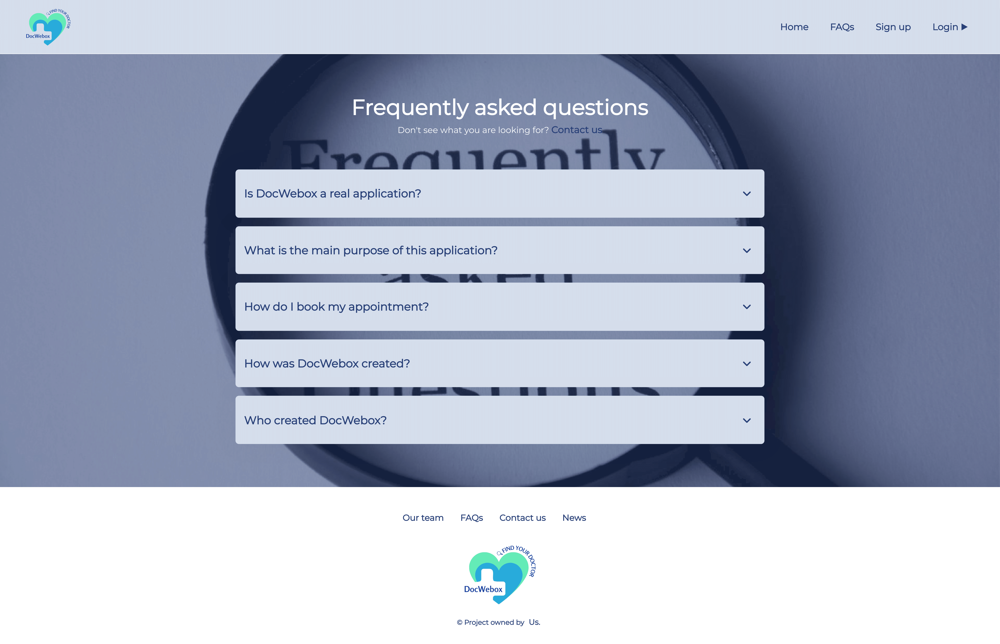
<h4>FAQs</h4>
<hr width="70%">


<h4>Contact us</h4>
<hr width="70%">

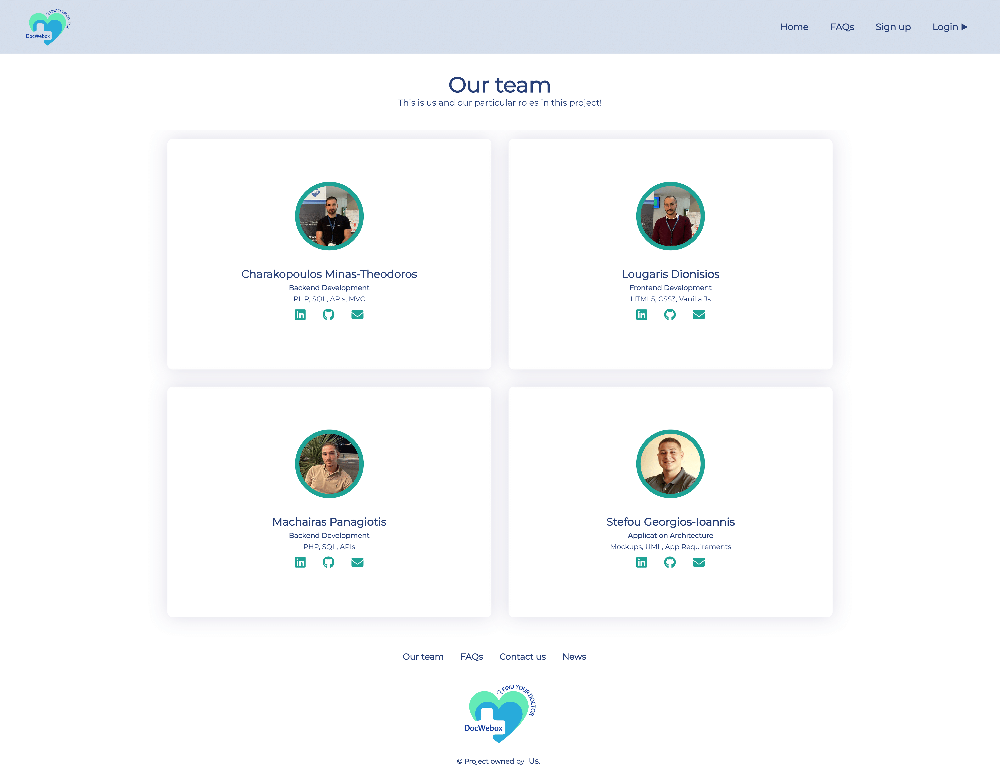
<h4>Our team</h4>
<hr width="70%">


<h4>Main login</h4>
<hr width="70%">

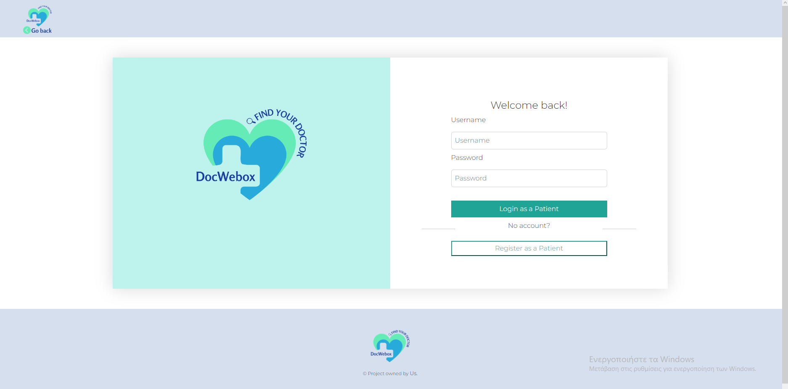
<h4>Patient's login</h4>
<hr width="70%">


<h4>Main register</h4>
<hr width="70%">

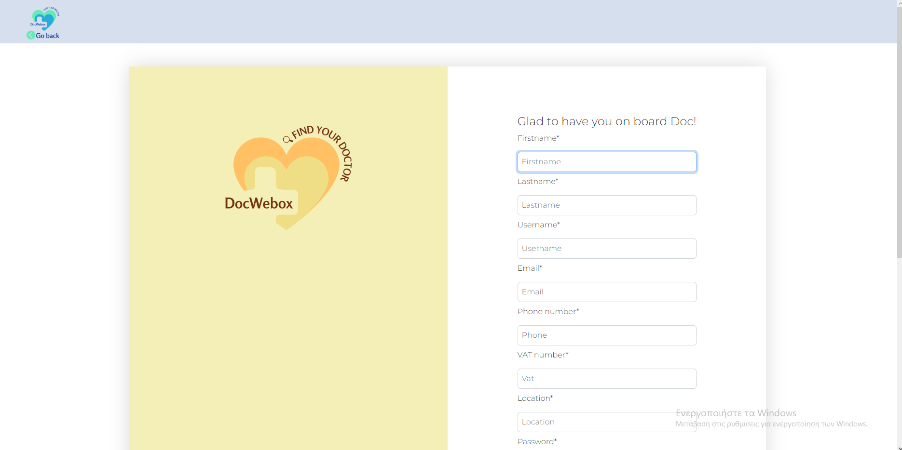
<h4>Doctor's register</h4>
<hr width="40%">


<h4>Patient's dashboard</h4>
<p>This is the main page of the patient, from where he can see previous and current appointments in the calendar, a list of doctors who have made appointments before, he can search for doctors based on their specialty, their location or both at the same time, and search for a doctor based on his lastname.</p>
<hr width="40%">

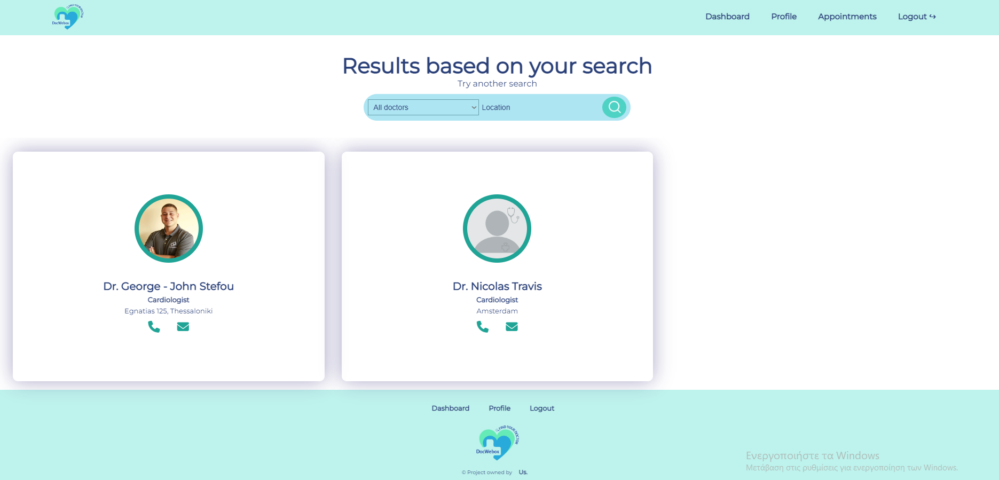
<h4>Patient's search for doctors results</h4>
<p>Here are all the results of his search with filters. If he simply presses the button without filters, then all the doctors will displayed.</p>
<hr width="40%">

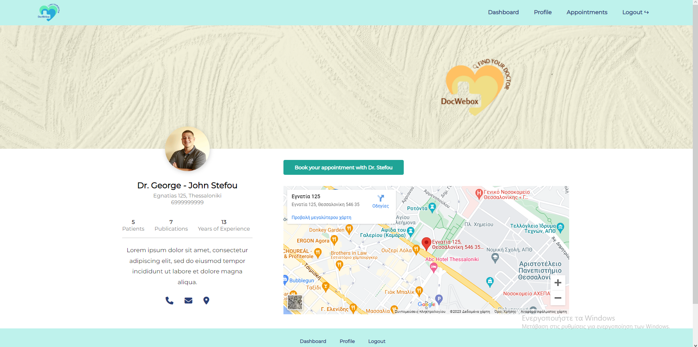
<h4>Doctor's public profile</h4>
<p>Here the patient can see information about the selected doctor and along the way if he wishes to make an appointment.</p>
<hr width="40%">

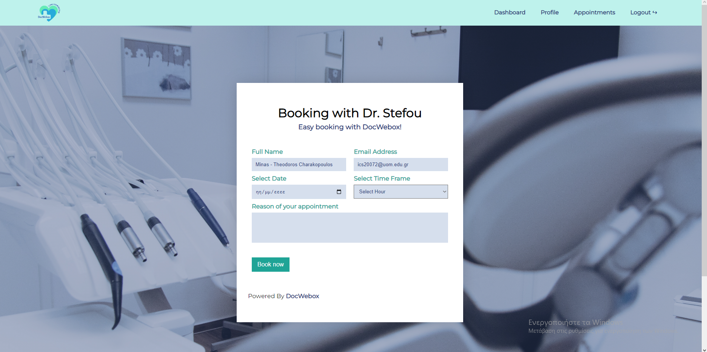
<h4>Appointment page</h4>
<hr width="40%">

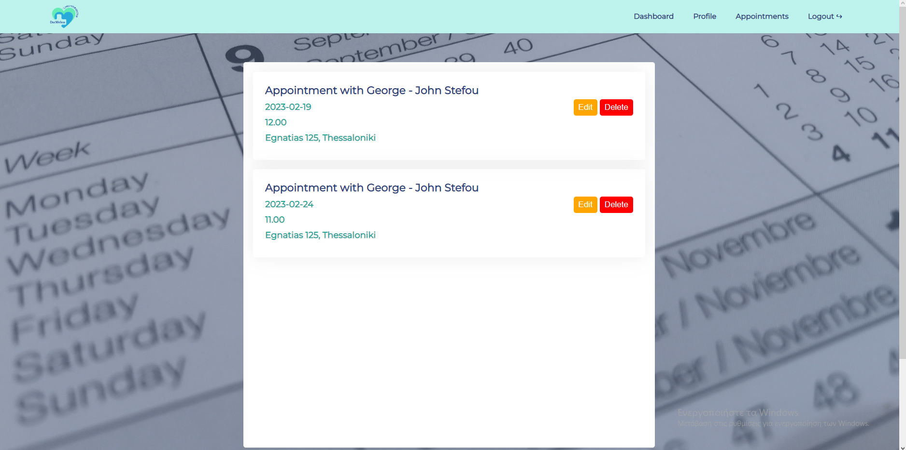
<h4>Patient's upcoming appointments</h4>
<hr width="40%">


<h4>Patient's private profile</h4>
<p>This is a page that only the logged patient has access to, and he has access to his previous appointments, and also to his data that he can see and update, such as email, password, username, profile photo, etc.</p>
<hr width="40%">

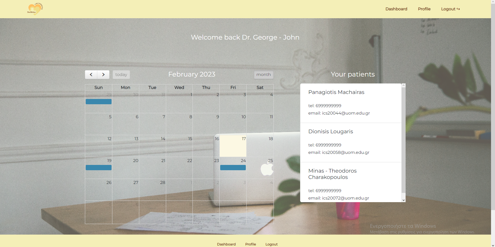
<h4>Doctor's dashboard</h4>
<p>This is the main page of the doctor, from where he can see previous and current appointments in the calendar and a list of the patients who have made appointment with him before.</p>
<hr width="40%">

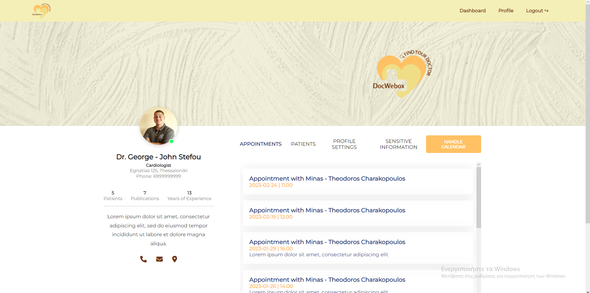
<h4>Doctor's private profile</h4>
<p>This is a page that only the logged doctor has access to, and he has access to his previous and current appointments, and also to his data that he can see and update, such as public information for his public profile, sensitive data such as email, password, username and upload a profile photo, etc.</p>
<hr width="40%">

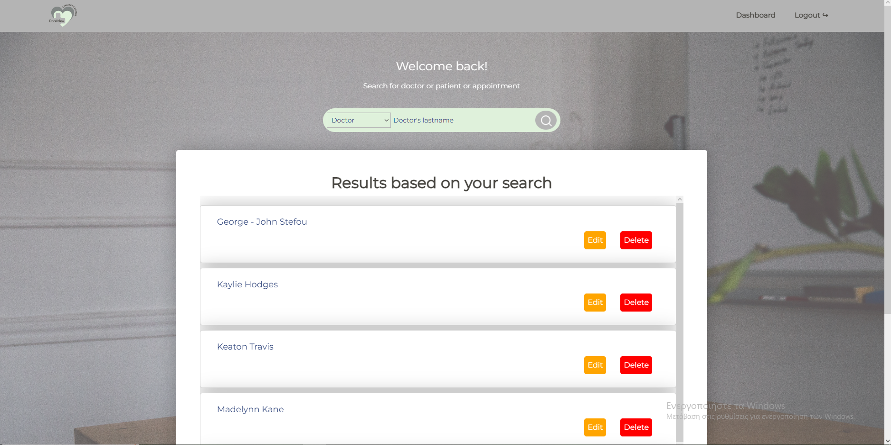
<h4>Admin's dashboard</h4>
<p>This is the admin dashboard. He can search for doctors, patients and appointments. For each of them he can either update or delete them.</p>
<hr width="40%">

# Responsiveness
<h4>All the pages are responsive for all devices.</h4>

<p float="left">
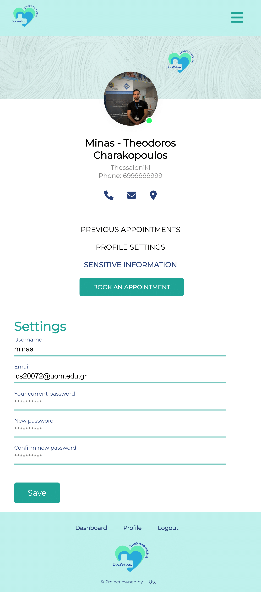
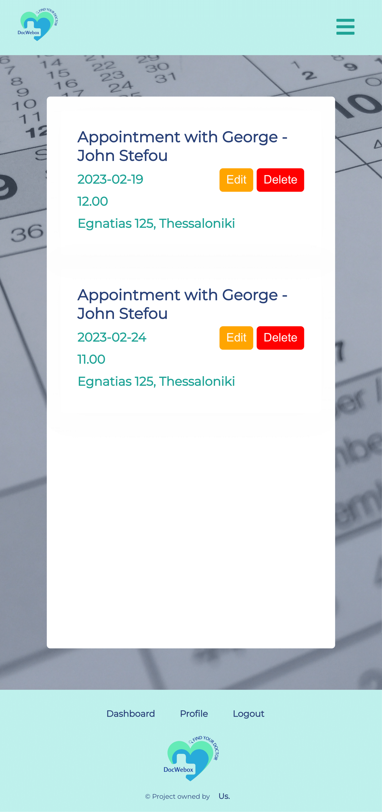
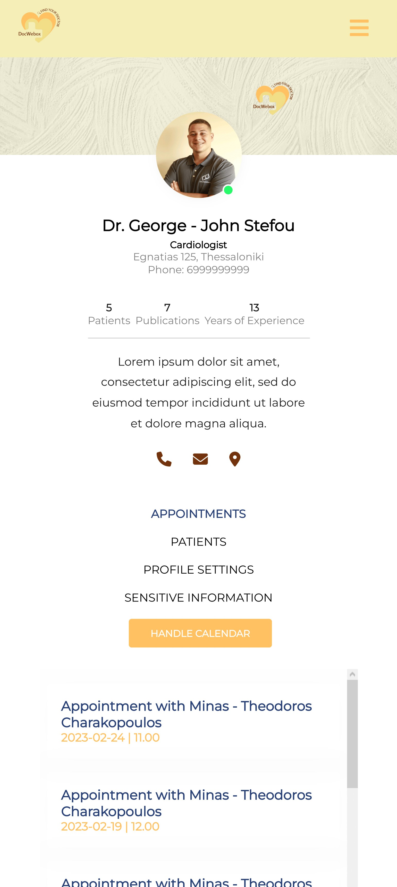
</p>

# How to create Admin?
<h4>The admin can only be created by phpmyadmin. You only need to provide a username and password. The password must be md5 encrypted during the creation.</h4>

# DB structure

```
DATABASE docwebox;

--
-- Structure for table `admin`
--

TABLE `admin` (
  `id` int(11) NOT NULL,
  `username` varchar(20) NOT NULL,
  `password` varchar(255) NOT NULL,
  `created` datetime DEFAULT current_timestamp()
) ENGINE=InnoDB DEFAULT CHARSET=utf8;

-- --------------------------------------------------------

--
-- Structure for table `appointment`
--

TABLE `appointment` (
  `id` int(11) NOT NULL,
  `doctor_id` int(11) NOT NULL,
  `patient_id` int(11) NOT NULL,
  `date` varchar(50) NOT NULL,
  `time` varchar(20) NOT NULL,
  `description` varchar(255) NOT NULL,
  `created` datetime DEFAULT current_timestamp()
) ENGINE=InnoDB DEFAULT CHARSET=utf8;

-- --------------------------------------------------------

--
-- Structure for table `doctor`
--

TABLE `doctor` (
  `id` int(11) NOT NULL,
  `firstname` varchar(40) NOT NULL,
  `lastname` varchar(40) NOT NULL,
  `username` varchar(20) NOT NULL,
  `email` varchar(255) NOT NULL,
  `password` varchar(255) NOT NULL,
  `phone` varchar(50) NOT NULL,
  `specialization` varchar(255) NOT NULL,
  `vat` varchar(40) NOT NULL,
  `num_patients` int(11) UNSIGNED NOT NULL,
  `num_publications` int(11) UNSIGNED NOT NULL,
  `work_experience_years` int(11) UNSIGNED NOT NULL,
  `bio` varchar(1000) NOT NULL,
  `location` varchar(255) NOT NULL,
  `image` varchar(255) NOT NULL,
  `created` datetime DEFAULT current_timestamp()
) ENGINE=InnoDB DEFAULT CHARSET=utf8;

-- --------------------------------------------------------

--
-- Structure for table `patient`
--

TABLE `patient` (
  `id` int(11) NOT NULL,
  `firstname` varchar(40) NOT NULL,
  `lastname` varchar(40) NOT NULL,
  `username` varchar(20) NOT NULL,
  `email` varchar(255) NOT NULL,
  `password` varchar(255) NOT NULL,
  `phone` varchar(50) NOT NULL,
  `location` varchar(255) NOT NULL,
  `image` varchar(255) NOT NULL,
  `created` datetime DEFAULT current_timestamp()
) ENGINE=InnoDB DEFAULT CHARSET=utf8;
```

# Local Installation
```
- Download the zip from github, extract it and store or move the app root folder in <PATH>\xampp\htdocs
  Note: It is important that the root folder of the app is located directly inside the htdocs, and not embedded in another folder.
- Open XAMPP and start Apache and MySQL modules
- Open browser in http://localhost/<FOLDER_NAME_THAT_YOU_STORE_IN_HTDOCS_BEFORE>/ 
  (At the same time, the 'docwebox' database with the necessary tables will also be created if it does not already exist.)
```

# Use testing data
<h4>Data is available for testing.</h4>
<ul>
<li><h4>In case the database and tables already exist, then execution by phpmyadmin of the {ROOT_FOLDER}/src/db/only_inserts.sql file, which only has inserts.</h4</li>
<li><h4>In case the database 'docwebox' does not already exist, then you can run the file {ROOT_FOLDER}/src/db/full_data_db.sql, which will create the database and tables, and then insert the testing data.</h4></li>
</ul>
